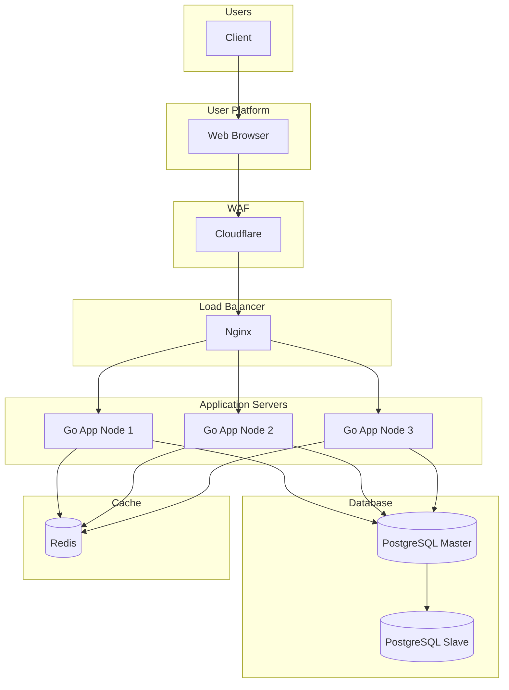

# High Level Design — Mini Instagram

## Infrastructure diagram

## Component list

| Layer | Technology | Notes |
|---|---|---|
| User | Client | Web user |
| Platform | Web browser | Single responsive web UI |
| WAF | Cloudflare | DDoS, CDN, DNS |
| Load balancer | Nginx | Distributes traffic across 3 app nodes |
| Application server | Go (Golang) | 3 nodes, stateless |
| Database | PostgreSQL | Master + Slave (read replica) |
| Cache | Redis | Hot data / sessions |
| Data warehouse | ClickHouse | Cold / unused data archive |

## Traffic flow

1. Client opens the web app in a browser.
2. Cloudflare filters traffic and caches static assets.
3. Nginx load-balances requests across the 3 Go application nodes.
4. App nodes read/write to the **PostgreSQL master** for writes.
5. App nodes read from the **PostgreSQL slave** for read-heavy queries.
6. App nodes use **Redis** for caching and short-lived state.
7. App nodes move cold or unused data to **ClickHouse** for long-term storage.
